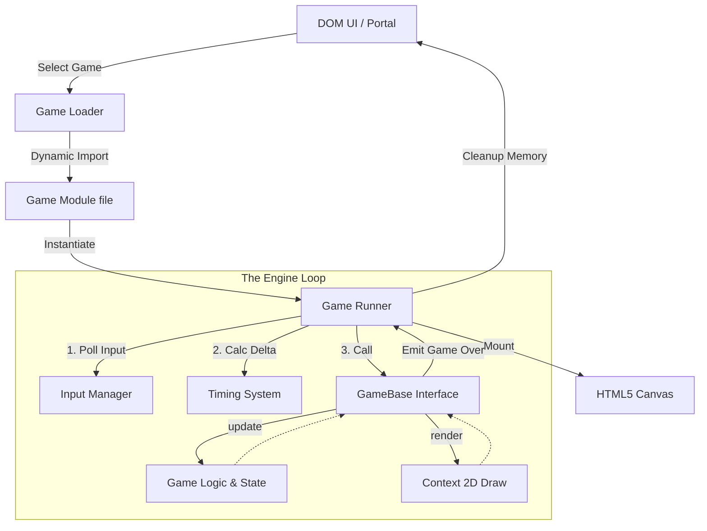

<div align="center">
  
  <h1>🎮 CHEAT LABZ 🎮</h1>
  <p><strong>The Universal Browser Gaming Engine</strong></p>

  [](https://developer.mozilla.org/en-US/docs/Web/JavaScript)
  [](https://developer.mozilla.org/en-US/docs/Web/API/Canvas_API)
  [](https://developer.mozilla.org/en-US/docs/Web/CSS/CSS_Grid_Layout)
  []()
  
  <br />
  
  [**Play Live Demo**](https://sharancode3.github.io/CHEAT-LABZ/) • 
  [**Architecture Docs**](#%EF%B8%8F-engine-architecture) • 
  [**Game Library**](#-game-library-35-games)
</div>

---

> [!NOTE]
> **Cheat Labz** is a production-grade, monolithic browser gaming platform featuring **35 custom-built games**. It operates entirely without external frameworks (No Unity, No Phaser, No React), relying on a highly optimized, proprietary Vanilla JS engine to deliver a seamless 60FPS Single Page Application (SPA) experience.

## ✨ Core Features

*   🚀 **Proprietary Engine:** The `GameRunner` loop handles input, delta-timing, and rendering uniformly across all 35 games.
*   🧠 **Advanced Mechanics:** Features A* Pathfinding (Pac-Man), Backtracking Solvers (Sudoku), Matrix Sliding (2048), and Elastic Impulse Physics (Air Hockey).
*   ⚔️ **Multiplayer Arena:** Includes 10 Local Shared-Keyboard PvP games with split controls.
*   🔊 **Synthesized Audio:** Custom Web Audio API synthesizer for retro chiptune effects (zero `.mp3` payloads).
*   📱 **Responsive Canvas:** Automatic logical-to-physical coordinate scaling across all screen sizes.
*   💾 **Local State:** High scores and progress persist silently via `localStorage`.

---

## 🏗️ Engine Architecture

Cheat Labz is designed around a strictly decoupled, object-oriented workflow that ensures zero memory leaks when dynamically switching between 35 different game contexts.

### 🔄 The Execution Lifecycle



### 🧩 Component Roles

| Component | Description | Responsibility |
| :--- | :--- | :--- |
| `GameRunner` | The Engine Heart | Hooks into `requestAnimationFrame`. Calculates `delta` time for monitor refresh-rate independence. Pumps data into the active game class. Handles garbage collection upon game exit. |
| `GameBase` | The Universal Interface | An abstract ES6 class that all 35 games extend. Enforces the implementation of `init()`, `update(delta)`, and `render(ctx)`. Provides standard utilities for clearing the screen and ending levels. |
| `InputManager` | The Controller | Attaches global event listeners for Keyboard/Mouse/Touch once. Abstracts physical events into logical states that `GameRunner` feeds to the current game, avoiding overlapping listeners. |
| `GameManifest` | The Router | A JSON-like configuration mapping game IDs to their specific ES6 `.js` file paths and metadata, enabling lazy-loaded dynamic imports. |

### 🛠️ The GameBase Contract

To create a new game, a developer simply extends the engine's core class:

```javascript
import { GameBase } from '../../core/game-base.js';

export class MyNewGame extends GameBase {
  init() {
    // 1. Define entities and initial state
    this.player = { x: 0, y: 0, velocity: 100 };
  }

  update(delta) {
    // 2. Process Input & Physics based on frame time
    if (this.input.keys['ArrowRight']) {
      this.player.x += this.player.velocity * delta;
    }
  }

  render(ctx) {
    // 3. Draw to the 1:1 aspect ratio canvas
    this.clear(); 
    ctx.fillStyle = '#10b981';
    ctx.fillRect(this.player.x, this.player.y, 50, 50);
  }
}
```

---

## 📂 Project Structure

> [!TIP]
> The repository is heavily modularized to maintain clean separation between DOM/UI logic and HTML5 Canvas Game Logic.

```text
CHEAT-LABZ/
├── 📄 index.html               # Landing Dashboard
├── 📄 games.html               # Universal Game Portal SPA
│
├── 📁 js/                      # Core Logic
│   ├── 📁 core/                # ⚙️ THE ENGINE
│   │   ├── runner.js           # requestAnimationFrame loop
│   │   ├── game-base.js        # Abstract class
│   │   ├── input.js            # Unified I/O
│   │   └── game-manifest.js    # Routing & Lazy-loading
│   │
│   ├── 📁 games/               # 🎮 THE GAME LIBRARY
│   │   ├── 📁 solo/            # Section A & B (25 Games)
│   │   └── 📁 multiplayer/     # Section C (10 Games)
│   │
│   └── 📁 ui/                  # 🖥️ DOM MANIPULATION
│       ├── home.js             # Landing page interactions
│       ├── game-modal.js       # Game UI wrapper & sidebar
│       └── filters.js          # Catalog sorting
│
└── 📁 css/                     # Styling
    ├── main.css                # Global Design Tokens
    └── games.css               # Portal & HUD Layouts
```

---

## 🎮 Game Library (35 Games)

The platform is divided into three major gameplay verticals.

### Section A: Arcade & Action (Solo)
*Reflex-driven physics and collision simulations.*

| ID | Title | Key Mechanics |
| :--- | :--- | :--- |
| 1 | **Flappy Bird** | Gravity/Velocity Physics |
| 2 | **Brick Breaker** | AABB Collision & Paddle English |
| 3 | **Asteroids** | Vector Math, Screen Wrapping |
| 4 | **Frogger** | Grid-based bounding, Lane traffic |
| 5 | **Space Invaders** | Swarm behavior, Projectile pooling |
| 6 | **Pac-Man Mini** | A* Pathfinding logic for Ghost AI |
| 7 | **Snake** | Array shifting, Matrix coordinates |
| 8 | **Tetris** | Matrix rotation, 2D Array collision |
| 9 | **Doodle Jump** | Camera translation, Procedural generation |
| 10 | **Pong** | AI Tracking, Elastic deflection |
| 11 | **Whack-a-Mole** | Event timers, Randomized node states |
| 12 | **Catch the Objects**| Falling object pooling |
| 13 | **Balloon Pop** | Sine-wave oscillation algorithms |
| 14 | **Clicker Hero** | Exponential scaling, Idle ticks |
| 15 | **Simon Says** | Sequence memory, Audio arrays |

### Section B: Word & Logic Puzzles (Solo)
*Heavy algorithmic focus utilizing recursion and matrices.*

| ID | Title | Key Mechanics |
| :--- | :--- | :--- |
| 16 | **Number Guessing** | Binary search logic |
| 17 | **Typing Speed Test** | WPM parsing, String validation |
| 18 | **Hangman** | String masking, State deterioration |
| 19 | **Word Scramble** | Fisher-Yates array shuffling |
| 20 | **Wordle** | 2-Pass Frequency Matrix validation |
| 21 | **2048** | 1D vector sliding and merging |
| 22 | **Sudoku** | Recursive Backtracking generation |
| 23 | **Sliding Puzzle** | Inversion Parity math (solvability) |
| 24 | **Minesweeper** | Breadth-First Search (BFS) Flood Fill |
| 25 | **Trivia Quiz** | Time-decay multiplier scoring |

### Section C: Multiplayer Arena (Local PvP)
*Shared-keyboard competitive duels designed for high APM.*

| ID | Title | Key Mechanics |
| :--- | :--- | :--- |
| 26 | **Tic-Tac-Toe** | Chess-clock round timers |
| 27 | **Pong Hyper-Rally**| Kinetic velocity transfer |
| 28 | **Rock Paper Scissors**| Tie-damage multiplier pots |
| 29 | **Snake vs Snake** | Simultaneous head-on collision |
| 30 | **Connect Four** | Animated drop states, Raycasting |
| 31 | **Memory Match** | Point-stealing trap triggers |
| 32 | **Tug of War** | Anti-macro stamina throttling |
| 33 | **Tank Trouble** | Vector ricochets (4-bounce max) |
| 34 | **Racing Dots** | Sequence staggering (Stumble penalty) |
| 35 | **Air Hockey** | Elastic circle-circle impulse physics |

---

## 🚀 Getting Started Locally

Because the project relies on **ES6 Modules** (`import` / `export`), it cannot be run directly via the `file://` protocol due to browser CORS security policies.

1. **Clone & Navigate**
   ```bash
   git clone https://github.com/sharancode3/CHEAT-LABZ.git
   cd CHEAT-LABZ
   ```

2. **Run a Local Server**
   ```bash
   # If you have Node/npm installed
   npx serve .
   # OR
   npm run dev
   ```

3. **Play!**
   Open `http://localhost:3000` (or your specific port) in your browser.

---

> [!WARNING]
> **Performance Note:** Cheat Labz relies heavily on `requestAnimationFrame`. If the browser tab loses focus, the engine automatically pauses the loop to preserve system resources and prevent delta-time explosion bugs upon returning.

<div align="center">
  <br/>
  <strong>Engineered with precision for the modern web.</strong>
  <br/>
  © Sharan S
</div>
