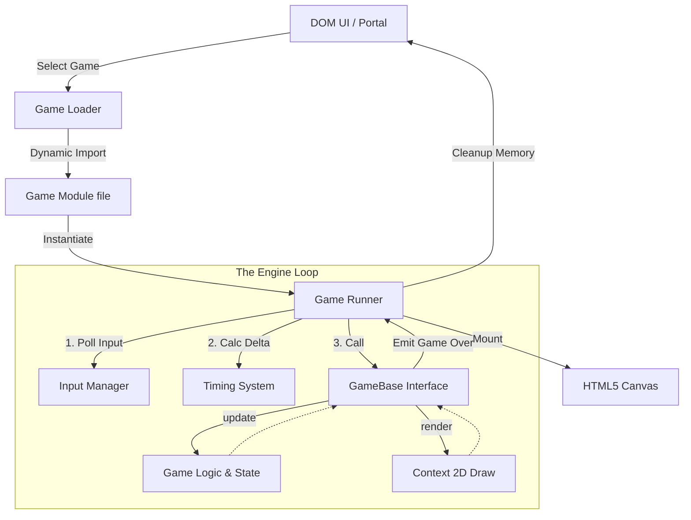

<div align="center">

# CHEAT LABZ
**The Universal Browser Gaming Engine**

[](https://developer.mozilla.org/en-US/docs/Web/JavaScript)
[](https://developer.mozilla.org/en-US/docs/Web/API/Canvas_API)
[](https://developer.mozilla.org/en-US/docs/Web/CSS/CSS_Grid_Layout)
[]()

*35 Custom-Built Games. 1 Proprietary Engine. Zero Dependencies.*

[**Play Live Demo**](https://sharancode3.github.io/CHEAT-LABZ/) • 
[**Engine Architecture**](#%EF%B8%8F-engine-architecture) • 
[**Game Library**](#-game-library)

</div>

---

> [!NOTE]
> **Cheat Labz** is a production-grade, monolithic browser gaming platform. It operates entirely without external heavy frameworks (No Unity, No Phaser, No React). By utilizing a highly optimized, proprietary Vanilla JS engine, Cheat Labz delivers a seamless **60FPS Single Page Application (SPA)** experience across 35 unique game contexts without page reloads.

## ✨ Why Cheat Labz?

Building a single web game is easy. Building **35 physics and logic games** that all run in the exact same DOM environment without memory leaks, overlapping event listeners, or garbage collection spikes is incredibly difficult. 

Cheat Labz solves this by abstracting the core loop (`requestAnimationFrame`), delta-timing, and I/O polling into a single, unified Engine (`GameRunner`).

*   🚀 **High Performance:** No DOM manipulation during gameplay. Everything is rendered via hardware-accelerated Canvas 2D.
*   🧠 **Algorithmic Depth:** Features A* Pathfinding (Pac-Man), Recursive Backtracking (Sudoku), Inversion Parity math (Sliding Puzzle), and Elastic Impulse Physics (Air Hockey).
*   ⚔️ **Multiplayer Arena:** 10 Local Shared-Keyboard PvP games with anti-ghosting split controls.
*   🔊 **Synthesized Audio:** A custom Web Audio API synthesizer generates retro chiptune effects dynamically (no bulky `.mp3` payloads).
*   💾 **Local State:** High scores, streaks, and progress persist silently via `localStorage`.

---

## 🏗️ Engine Architecture

Cheat Labz is designed around a strictly decoupled, object-oriented workflow.

### The Execution Lifecycle



### Component Breakdown

| Component | Responsibility | Description |
| :--- | :--- | :--- |
| **`GameRunner`** | *The Engine Heart* | Hooks into `requestAnimationFrame`. Calculates `delta` time for monitor refresh-rate independence. Pumps data into the active game class. Handles garbage collection upon game exit. |
| **`GameBase`** | *The Universal Interface* | An abstract ES6 class that all 35 games extend. Enforces the implementation of `init()`, `update(delta)`, and `render(ctx)`. Provides standard utilities for clearing the screen and ending levels. |
| **`InputManager`** | *The Controller* | Attaches global event listeners for Keyboard/Mouse/Touch *once*. Abstracts physical events into logical states that `GameRunner` feeds to the current game. |
| **`GameManifest`** | *The Router* | A JSON configuration mapping game IDs to their specific ES6 `.js` file paths, enabling lazy-loaded dynamic imports. |

<br/>

<details>
<summary><b>Click to see: The Developer Contract (How to build a game)</b></summary>
<br/>

To create a new game, a developer simply extends the engine's core class and implements three methods:

```javascript
import { GameBase } from '../../core/game-base.js';

export class MyNewGame extends GameBase {
  init() {
    // 1. Define entities and initial state
    this.player = { x: 0, y: 0, velocity: 100 };
  }

  update(delta) {
    // 2. Process Input & Physics based on frame time
    if (this.input.keys['ArrowRight']) {
      this.player.x += this.player.velocity * delta;
    }
  }

  render(ctx) {
    // 3. Draw to the canvas
    this.clear(); 
    ctx.fillStyle = '#10b981';
    ctx.fillRect(this.player.x, this.player.y, 50, 50);
  }
}
```
</details>

---

## 📂 Project Structure

> [!TIP]
> The repository is heavily modularized to maintain strict separation between DOM/UI logic and HTML5 Canvas Game Logic.

```text
CHEAT-LABZ/
├── 📄 index.html               # Landing Dashboard
├── 📄 games.html               # Universal Game Portal SPA
│
├── 📁 js/                      
│   ├── 📁 core/                # ⚙️ THE ENGINE (Runner, Input, Base)
│   ├── 📁 games/               # 🎮 THE GAME LIBRARY (35 ES6 Modules)
│   └── 📁 ui/                  # 🖥️ DOM MANIPULATION & Overlays
│
└── 📁 css/                     # Global Design Tokens & Grid Layouts
```

---

## 🎮 Game Library 

The platform features 35 fully playable titles across three major gameplay verticals.

<details open>
<summary><b>Section A: Arcade & Action (15 Games)</b></summary>
<br/>

*Reflex-driven physics and collision simulations.*

| Title | Key Mechanics & Algorithms |
| :--- | :--- |
| **Flappy Bird** | Gravity/Velocity Physics |
| **Brick Breaker** | AABB Collision & Paddle English |
| **Asteroids** | Vector Math, Screen Wrapping |
| **Frogger** | Grid-based bounding, Lane traffic |
| **Space Invaders** | Swarm behavior, Projectile pooling |
| **Pac-Man Mini** | A* Pathfinding logic for Ghost AI |
| **Snake** | Array shifting, Matrix coordinates |
| **Tetris** | Matrix rotation, 2D Array collision |
| **Doodle Jump** | Camera translation, Procedural generation |
| **Pong** | AI Tracking, Elastic deflection |
| **Whack-a-Mole** | Event timers, Randomized node states |
| **Catch the Objects**| Falling object pooling |
| **Balloon Pop** | Sine-wave oscillation algorithms |
| **Clicker Hero** | Exponential scaling, Idle ticks |
| **Simon Says** | Sequence memory, Audio arrays |

</details>

<details open>
<summary><b>Section B: Word & Logic Puzzles (10 Games)</b></summary>
<br/>

*Heavy algorithmic focus utilizing recursion and matrices.*

| Title | Key Mechanics & Algorithms |
| :--- | :--- |
| **Number Guessing** | Binary search logic |
| **Typing Speed Test** | WPM parsing, String validation |
| **Hangman** | String masking, State deterioration |
| **Word Scramble** | Fisher-Yates array shuffling |
| **Wordle** | 2-Pass Frequency Matrix validation |
| **2048** | 1D vector sliding and merging |
| **Sudoku** | Recursive Backtracking generation & solving |
| **Sliding Puzzle** | Inversion Parity math (solvability check) |
| **Minesweeper** | Breadth-First Search (BFS) Flood Fill |
| **Trivia Quiz** | Time-decay multiplier scoring |

</details>

<details open>
<summary><b>Section C: Multiplayer Arena (10 Games)</b></summary>
<br/>

*Shared-keyboard competitive local PvP duels.*

| Title | Key Mechanics & Algorithms |
| :--- | :--- |
| **Tic-Tac-Toe** | Chess-clock round timers |
| **Pong Hyper-Rally**| Kinetic velocity transfer modifiers |
| **Rock Paper Scissors**| Tie-damage multiplier pots |
| **Snake vs Snake** | Simultaneous head-on collision |
| **Connect Four** | Animated drop states, Raycasting |
| **Memory Match** | Point-stealing trap triggers |
| **Tug of War** | Anti-macro stamina throttling |
| **Tank Trouble** | Vector ricochets (4-bounce max) |
| **Racing Dots** | Sequence staggering (Stumble penalty) |
| **Air Hockey** | Elastic circle-circle impulse physics |

</details>

---

## 🚀 Quick Start (Local Development)

Because Cheat Labz uses native **ES6 Modules** (`import` / `export`), it cannot be run directly via the `file://` protocol due to browser CORS security policies. You must run it through a local web server.

```bash
# 1. Clone the repository
git clone https://github.com/sharancode3/CHEAT-LABZ.git
cd CHEAT-LABZ

# 2. Start a local server (using npm)
npm install
npm run dev

# OR using a simple python server if you don't have Node installed:
python -m http.server 3000
```

> [!WARNING]
> **Performance Optimization:** Cheat Labz relies heavily on `requestAnimationFrame`. If the browser tab loses focus, the engine automatically pauses the execution loop to preserve system resources and prevent delta-time explosion bugs when the user returns.

---

<div align="center">
  <br/>
  <strong>Engineered with precision for the modern web.</strong>
  <br/>
  © Sharan S
</div>
